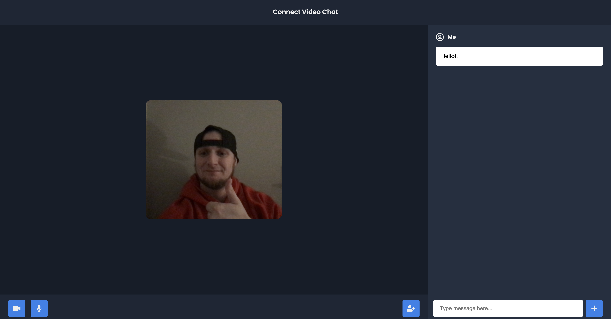

# Connect Video Chat App

### A very imple to use video chat app.
### Just enter your name and invite friends via link and you are good to go!

Check out the live demo: 

# Launguages and Frameworks used

* HTML
* CSS
* JavaScript
* NodeJS  
* Socket.io 
* Peerjs(WebRTC)

# How to run the project?

1. Clone this repository in your local system.
2. Open the command prompt from your project directory and run the command `npm install`.
3. Open the command prompt from your project directory and run the command `npm start`.
4. Go to your browser and type `http://127.0.0.1:3030/` in the address bar.
5. Thats it! You'll be up and running! Able to invite friends to video and text chat with you. Great place for a virtual hangout, grouyp study, or just a casual chat with friends!

# Post Deployment

* Anyone can clone the repository and use it to continute to create their own version of the app with a React frontend and other features.

## Author

- [Nick Hastings](https://nhastings1.github.io/Nick-Hastings-React-Portfolio/)

